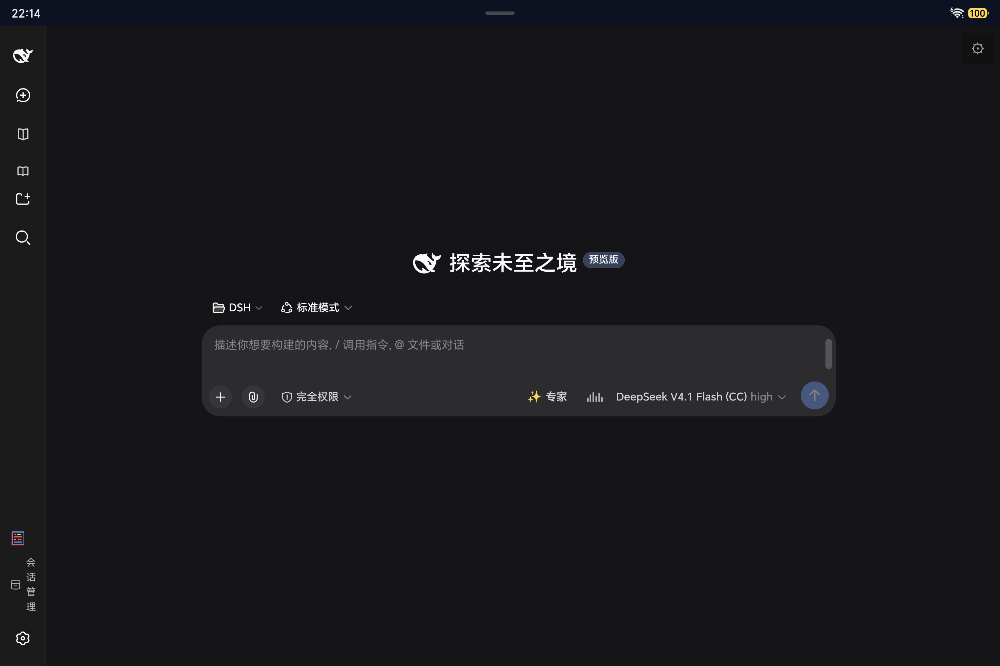
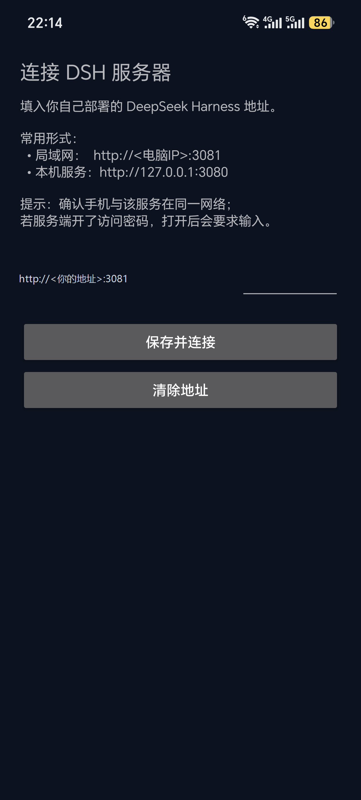

# DSH Mobile

> 在平板 / 手机上**像原生 App 一样**使用你自己部署的 [DeepSeek Harness](https://github.com/deepseek-ai/deepseek-harness)。

[](LICENSE)
[](../../releases)
[-brightgreen.svg)](#安装)
[](../../releases)

一个**极简 WebView 容器**（约 3 MB）。**不含 DSH 本体**，也**不内置任何服务器地址** —— 填入你自己的服务地址即可。

---

## 界面预览

| 全屏主界面（平板 · 无浏览器地址栏） | 服务器设置（手机） |
|---|---|
|  |  |

> 截图取自真机：平板 HONOR CHG-W60（横屏）· 手机（竖屏，地址已打码）。

---

## 特性

| 特性 | 说明 |
|---|---|
| **全屏** | 无浏览器地址栏，与原生 App 一致 |
| **返回键** | 网页后退 / 双击退出 |
| **麦克风·摄像头** | 自动授权（语音输入可用） |
| **登录态持久** | Cookie 自动保存，不必反复登录 |
| **右上角 ⚙** | 随时切换服务器地址 |
| **首次引导** | 未填地址时自动进入设置页 |
| **连不上有提示** | 不会静默白屏 |

---

## 前置：先跑起 DSH

本 App 只是「客户端」。**你需要先有一个可访问的 DSH 服务**：

### 方式 A · 电脑跑（推荐，性能好）

```bash
npm i -g @deepseek-ai/dsh
dsh web --port 3080 --no-open
```

让**手机与电脑处于同一局域网**。若要手机能访问，装 `dsh-pocket` 插件并打开「局域网访问」（默认端口 **3081**）。

> ⚠️ **强烈建议开启访问密码（PIN）** —— 否则同一网络下的任何设备都能操作你的电脑。

### 方式 B · 手机/平板本机跑（离线可用，较慢）

DSH 依赖 Linux 的 `flock`，而 Termux 的 Node 报告 `platform=android`，故需用 proot 容器：

```bash
apt install -y proot-distro
proot-distro install docker.m.daocloud.io/library/debian:12
proot-distro login debian
# 容器内：
apt install -y nodejs npm && npm i -g @deepseek-ai/dsh
dsh web --port 3080 --no-open
```

地址填 `http://127.0.0.1:3080`。

---

## 安装

1. 从 [Releases](../../releases) 下载 APK
2. 系统设置里允许「安装未知来源应用」
3. 安装并打开
4. 在设置页填入你的 DSH 地址

---

## 自己构建

```bash
# 需要 JDK 17+ 与 Android SDK（platform-34 + build-tools 34.0.0）
export ANDROID_HOME=/path/to/android-sdk
./gradlew assembleDebug
# 产物：app/build/outputs/apk/debug/app-debug.apk
```

也可用系统 Gradle：`gradle assembleDebug`。

---

## 与同类项目的区别

`dsh-mobile` 这个名字在社区被多个项目使用，**本项目与它们的定位不同**（下表数据核验于 2026-09-21）：

| 项目 | 技术栈 | 定位 | 本项目 |
|---|---|---|---|
| **本项目** `LHN-xiao-hai-tun/dsh-mobile` | Java + Android SDK | **极简 WebView 遥控器**：约 3 MB，**不含任何运行时**，连接你自己电脑/设备上的 DSH | — |
| [`saya-ch/dsh-mobile`](https://github.com/saya-ch/dsh-mobile) | TypeScript | Android App + 安全远程访问插件，高度自定义的移动界面与扩展能力 | 不采用（依赖与体积更重） |
| [`Thanksgiver233/dsh-mobile`](https://github.com/Thanksgiver233/dsh-mobile) | Kotlin | 内置 Node.js ARM64 与 dsh CLI 的**手机本地运行**方案，APK 即跑 | 不采用（本机跑 DSH 另有 proot 路线） |
| [`jayantTang/DSH_Mobile`](https://github.com/jayantTang/DSH_Mobile) | Swift | **iOS** 客户端，WSS 经公网中转 | 不采用（平台不同） |

**为什么走极简路线**

- **体积**：约 **3 MB**，不占用手机存储，也不携带 Node.js 运行时
- **隐私**：不预置服务器地址、不采集数据、无广告统计、无第三方 SDK
- **职责单一**：只负责「让手机像原生 App 一样访问你的 DSH」；DSH 本体与插件生态留在你自己的机器上，升级互不影响

---

## 隐私

- **不采集、不上传任何数据**
- 只在本机 `SharedPreferences` 保存你填的服务器地址
- 无广告、无统计、无第三方 SDK

---

## 许可

本项目采用 [MIT 许可](LICENSE)。

变更记录见 [CHANGELOG.md](CHANGELOG.md)。
